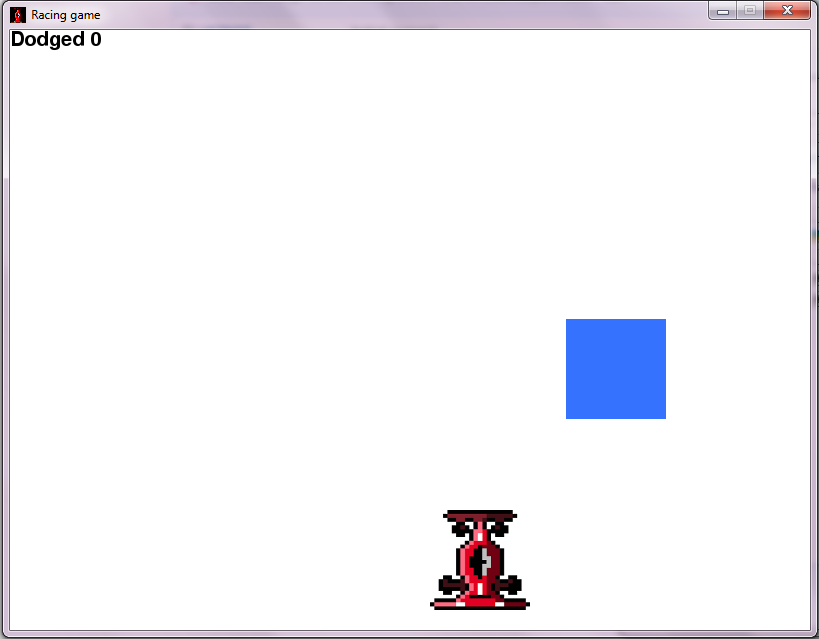

# Simple Racing Game
A simple racing game made for cross platform desktops using Pygame.

To run, type the following on your terminal (command prompt) -

	python run.py

Dependencies -
* Python
* [PyGame](https://www.pygame.org/news)
